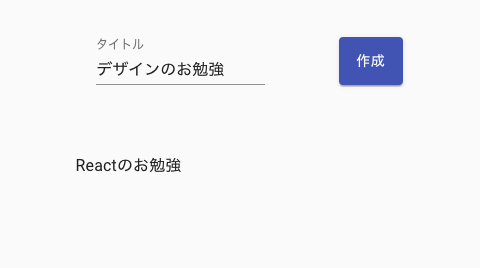

# Todoアプリの作成
## 導入
Reactの一番はじめの作品として簡単なタスク管理アプリを作成します.  
エンジニア界隈ではよくTodoアプリと呼ばれており, フロントエンド技術者が初めてのフレームワークや言語を触る際, よく作成するアプリです.  
なぜTodoアプリを作成するのか.  
それは, CRUD(クラッド)というソフトウェアの基本機能を全て持つアプリだからです. 以下の表にその説明を示します.  

|名前|操作|
|---|---|
|Create|生成|
|Read|読み取り|
|Update|更新|
|Delete|削除|  

これらの機能からTodoアプリはチュートリアルに最適と考えられています.  
それでは実際に作成していきましょう.  

## 開発環境
以下のバージョンで開発を行います.  
予め以下のコマンドが使用できることを確認してください.  
- **node** v12.8.0
- **yarn** v1.21.0
- **create-react-app** v3.3.0

## 雛形の作成
任意のディレクトリで以下のコマンドを実行してください.
```zsh
$ create-react-app todo-app
$ cd todo-app
$ yarn start
```
うまくいくとサーバが立ち上がりブラウザに表示されます.  

## コードの編集
todo-appフォルダ内の構成は以下のようになっています.
```
.
├── README.md
├── package.json
├── public
│   ├── favicon.ico
│   ├── index.html
│   ├── logo192.png
│   ├── logo512.png
│   ├── manifest.json
│   └── robots.txt
├── src
│   ├── App.css
│   ├── App.js
│   ├── App.test.js
│   ├── index.css
│   ├── index.js
│   ├── logo.svg
│   ├── serviceWorker.js
│   └── setupTests.js
└── yarn.lock
```  
主となるファイルは src 内に存在しており
index.jsでApp.jsを呼び出して public/index.html に表示しています.  
App.jsを編集していくことでTodoアプリを作成していきます.  

App.jsを以下のように変更してみてください.
ブラウザの表示が変わると思います.  
このようにReactにはホットリロードという機能がありコードが変更されセーブされると自動的に表示を更新してくれます.  

```js:app.js
import React from 'react'
import './App.css'

function App() {
  return (
    <div className="App">
      <header className="App-header">
        <p>Hello Tommy</p>
      </header>
    </div>
  )
}

export default App
```

## コードの説明
### import
モジュールや外部ファイルをインポートすることで, インポートしたファイル内でそれらを使用することができます.  
### export
インポートの逆でエクスポートすることで外部ファイルでエクスポートしたものを使用することができます.  
### return内
見た目はHTMLとほぼ変わりませんが, JSXという記法がReactでは採用されています.  
HTMLと違い内部で変数を使用したり, プログラムを埋め込むことができます.  

## Break Time
セミコロン `;` はなくてもよいです.  
個人的には書かないほうがきれいで見やすいと感じます.  

## コンポーネントとは
コンポーネントとはUIを構築する部品のことです.  
コンポーネントを組合せてUIを作成していきます.  

## 1章完成形

## UIの作成
今回は material-ui というフレームワークを用いてUIを作成します.  
> https://material-ui.com/  

material-uiとフォントの導入をします.

```zsh
yarn add @material-ui/core
yarn add @material-ui/icons
yarn add typeface-roboto
```

App.jsを書き換えます.

```js
import React from 'react'
import 'typeface-roboto'
// 必要なコンポーネントをインポートする
import { Button, TextField, Box, Container, CssBaseline, List, ListItem, ListItemText } from '@material-ui/core'

function App() {
  return (
    <Container 
      component='main' 
      maxWidth='xs'
    >
      <CssBaseline />
      <Box
        mt={5}
        display='flex'
        justifyContent='space-around'
      >
        <TextField
          label='タイトル'
        />
        <Button
          variant='contained'
          color='primary'
        >
          作成
        </Button>
      </Box>
      <List
        style={{ marginTop: '48px' }}
      >
        <ListItem>
          <ListItemText>タスク1</ListItemText>
        </ListItem>
        <ListItem>
          <ListItemText>タスク2</ListItemText>
        </ListItem>
      </List>
    </Container>
  )
}

export default App
```

## タスクの管理
UIができたので次はデータを追加していきます.  
コンポーネントは state と呼ばれる状態を持つことができます.  
```js
// stateを作成するために追加
import React, { useState } from 'react'
import 'typeface-roboto'
import { Button, TextField, Box, Container, CssBaseline, List, ListItem, ListItemText } from '@material-ui/core'

function App() {
  // stateの作成
  // useStateの引数が初期値
  const [tasks, setTasks] = useState([
    {
      id: 1,
      title: 'Reactのお勉強',
    }
  ])

  return (
    <Container 
      component='main'
      maxWidth='xs'
    >
      {/* 中略 */}
    </Container>
  )
}

export default App
```

## タスクの表示
tasksは配列なのでmap関数を使用して取り出します.  

```js
// 略
function App() {
  // 略
  return (
    <Container 
      component='main'
      maxWidth='xs'
    >
      {/* 中略 */}
     <List
        style={{ marginTop: '48px' }}
      >
        {tasks.map(task => (
          // keyは重複しない値にする
          <ListItem key={task.id}>
            <ListItemText>{task.title}</ListItemText>
          </ListItem>
        ))}
      </List> 
    </Container>
  )
}

export default App
```

## タスクの追加
TextFieldからタスクを追加できるようにします.  
TextFieldに入力されたタスク名を取得する必要があるのでstateを追加します.  

```js
// 略

function App() {
  const [tasks, setTasks] = useState([
    {
      id: 1,
      title: 'Reactのお勉強',
    }
  ])
  // stateの追加
  const [task_title, setTask_title] = useState('')
  return (
    // 略
    <TextField
      label="タイトル"
      value={task_title}
      // 入力が変更されるたびにtask_titleに代入する
      onChange={e => setTask_title(e.target.value)}
    />
    <Button
      variant='contained'
      color='primary'
      // task_titleが空のときはボタンを押せないようにする
      disabled={task_title === '' ? true : false}
      // ボタンがクリックされるとtasks配列に追加し、task_titleを初期化する
      onClick={() => {
        setTasks([...tasks, {
          id: tasks.length + 1,
          title: task_title,
        }])
        setTask_title('')
      }}>
        作成
    </Button>
  )
}

export default App
```